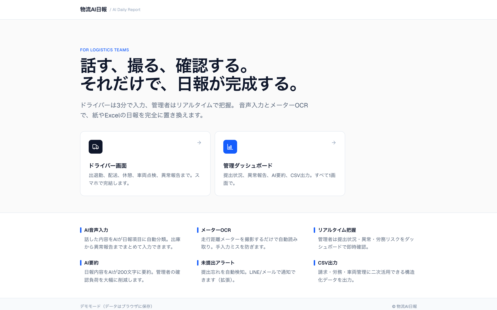
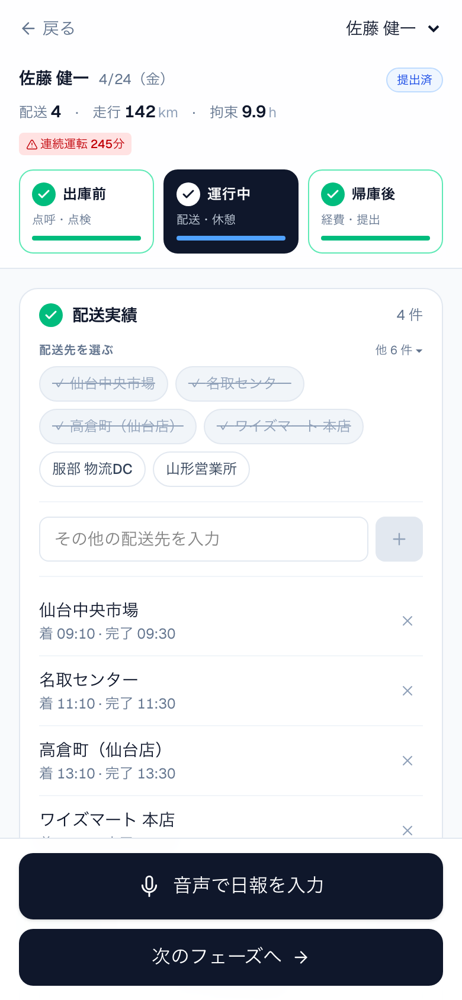
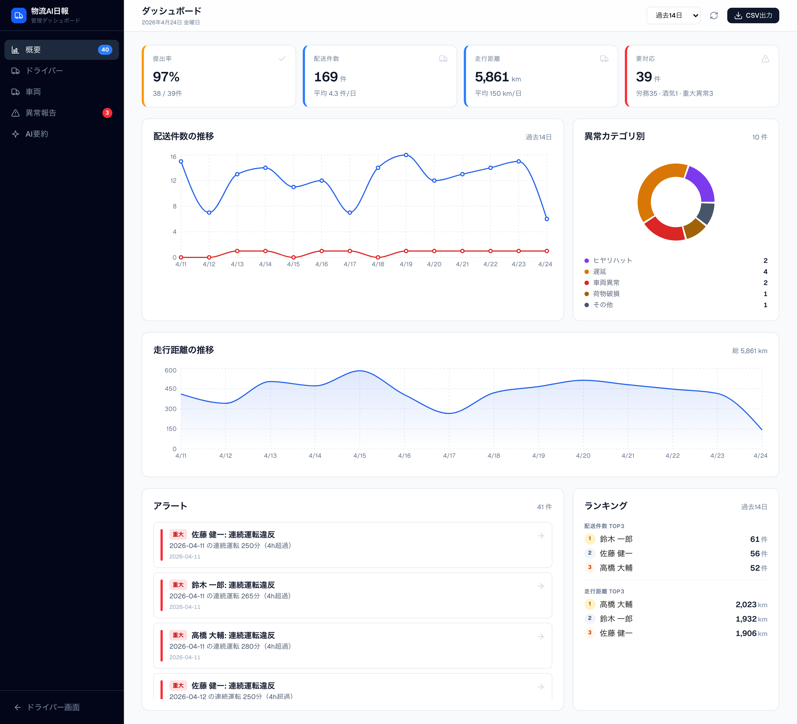
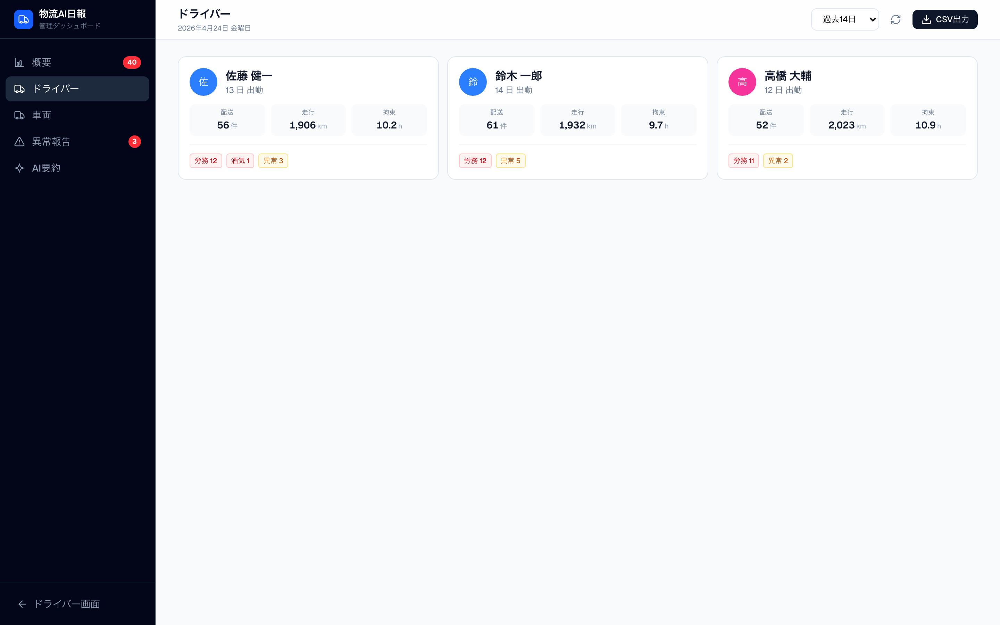
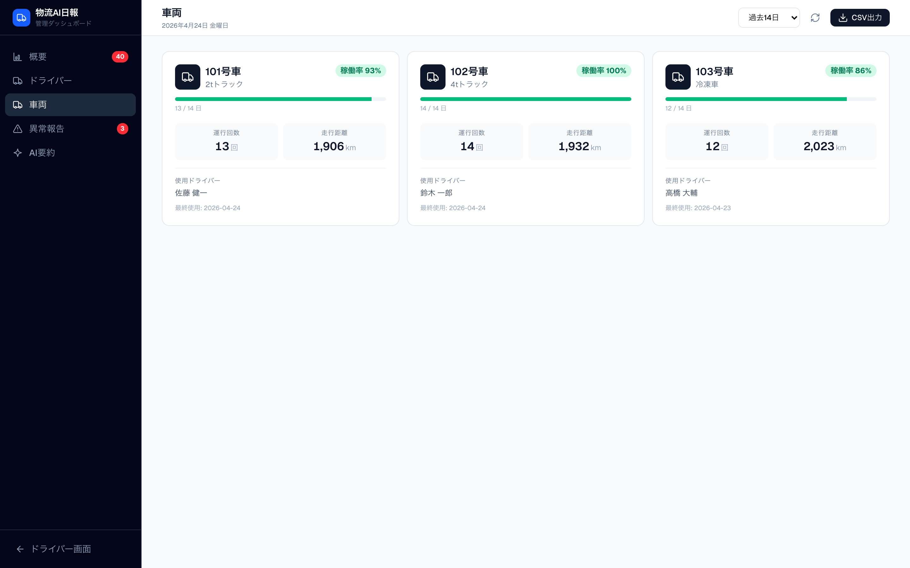
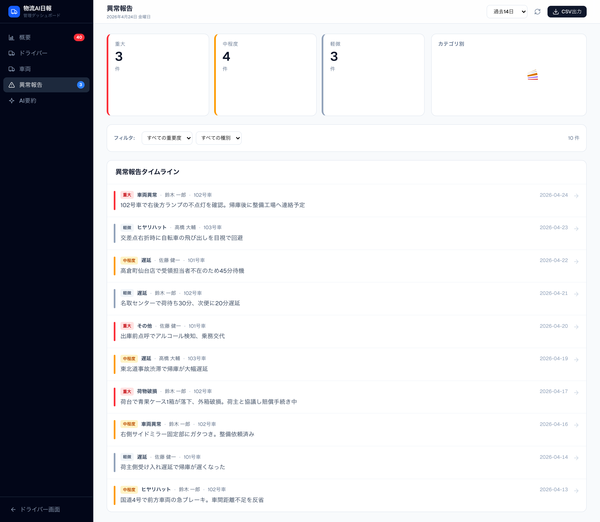

# 物流AI日報 — サービス概要

> **話す、撮る、確認する。それだけで、日報が完成する。**
> ドライバーは3分で入力、管理者はリアルタイムで把握。
> 紙やExcelの運行日報を、スマホ完結のAIアプリで完全に置き換えます。

🔗 デモ: **https://logistics-daily-report.vercel.app**

---

## 解決する課題

物流の現場では、毎日の運行日報の作成と管理に多くの時間と手間がかかっています。

- ドライバー: 帰庫後に紙やExcelで手書き → 時間外労働の温床、書き漏れ
- 管理者: 日報を一枚ずつ確認 → 異常の見逃し、月末の集計に半日
- 経理・労務: 改善基準告示の遵守チェック、請求データへの転記が手作業

**本アプリは、この一連の流れをスマホ + AI で完結させます。**

---

## ホーム画面

トップページから「ドライバー画面」「管理ダッシュボード」のいずれかにアクセス。
スマホ・タブレット・PC どの端末からでも同じ操作感で利用できます。

---

## 主な機能

### 1. AI音声入力でほぼ自動入力

画面下部のマイクボタンを押して話すだけで、AIが日報項目に自動で振り分けます。

> 「今日は8時に出勤、8時半に出庫、仙台中央市場に10時着、休憩は12時から13時、5時10分帰庫、走行148キロ、異常なし」

→ 出勤・出庫・帰庫の時刻、配送先、休憩、走行距離が一括で入力されます。

### 2. メーター撮影でOCR読み取り

走行距離メーターを撮影するとAIが数字を自動で読み取ります。
手入力ミスや桁間違いを完全に防止します。

### 3. アルコールチェック・点呼の電子化

改正道路交通法で義務化された出庫前・退勤前のアルコールチェックを記録。
0.15 mg/L 以上で自動的に「要対応」判定。1年保存に対応します。

### 4. 改善基準告示の自動判定

2024年4月適用の労務基準（拘束13h・連続運転4h・休息11h）を自動チェック。
違反・警戒があると即座にアラート表示します。

---

## ドライバー画面（スマホ最適化）

物流現場のオペレーション順に **3フェーズ** で進めるシンプルな構成。
迷わずに最後の「提出」までたどり着けます。

| 出庫前 | 運行中 | 帰庫後 |
|---|---|---|
| 車両選択 / アルコールチェック / 出勤・出庫 / 出庫メーター | 配送実績（プリセット選択）/ 休憩 / 異常報告 | 帰庫・退勤 / 帰庫メーター / 経費 / 退勤前点呼 |

**配送先はワンタップ追加**。よく使う配送先を画面上部のチップから選ぶだけ。
画面下部には音声入力ボタンと「次のフェーズへ」ボタンが常時固定されており、
どのフェーズからでも一括入力できます。

---

## 管理ダッシュボード

5タブ構成（概要・ドライバー・車両・異常報告・AI要約）で、運行状況を俯瞰できます。

**ダッシュボードで一目でわかること**

- 提出率・配送件数・走行距離・要対応件数（拘束/酒気/重大異常）
- 配送件数と異常件数の **日別推移グラフ**
- 異常カテゴリ別の **ドーナツチャート**
- 走行距離の **エリアチャート**
- **アラートセンター**（重要度順・クリックで該当日報の詳細を表示）
- ドライバー別 **配送・走行距離ランキング**

### ドライバー別タブ

各ドライバーの出勤日数・配送・走行・異常件数をカードで表示。
カードを選ぶと、そのドライバーの **個人別トレンドグラフ + 日報履歴** が見られます。

### 車両別タブ

車両ごとの **稼働率バー**、運行回数、走行距離、使用ドライバーを把握。
稼働率に応じて色分けされ、遊休車両の特定や繁忙車両の負荷分散に活用できます。

### 異常報告タブ

すべての異常をタイムライン形式で表示。重要度・種別でフィルタ可能。
事故・荷物破損などの重大事象を見逃さず、再発防止策の検討に役立ちます。

---

## 触り方（クライアント向けデモガイド）

1. **PC または スマホ** で https://logistics-daily-report.vercel.app を開く
2. **「ドライバー画面」** をタップ → 出庫前 → 運行中 → 帰庫後 の順に触る
3. 画面下のマイクボタンで音声入力を試す（要 Gemini API 設定）
4. **「管理ダッシュボード」** に戻り、日付セレクタで過去日を表示
5. アラートセンターの項目をタップして詳細モーダルを確認
6. 右上の「CSV出力」で月次データをダウンロード

> **デモモード** で動作中のため、入力データはブラウザ内に保存され、
> 他社の方のデータと混ざることはありません。

---

## 技術構成

| 項目 | 採用技術 |
|---|---|
| フロントエンド | Next.js 16 + React 19 + TypeScript + Tailwind CSS |
| 状態管理 | localStorage（デモ）/ Supabase Postgres（本番想定） |
| AI | Google Gemini 2.5 Flash（音声→テキスト+項目分類、画像OCR、要約） |
| ホスティング | Vercel |
| デプロイ | GitHub 連携で自動デプロイ |

**想定ランニングコスト**: ドライバー30名・月20稼働日で **月 30〜50 USD 程度**（Gemini API 利用料）

---

## 法令準拠

| 法令 | 対応内容 |
|---|---|
| 改正道路交通法（2023年12月〜） | 出庫前・退勤前のアルコールチェック+検知器使用、酒気帯び記録、1年保存 |
| 改善基準告示（2024年4月〜） | 拘束13h・連続運転4h・休息11h を自動判定、違反検知でアラート |
| 貨物自動車運送事業輸送安全規則 | 運転日報の必須8項目（運転者・日時・距離・配送先・異常 ほか）を網羅 |
| 道路運送車両法 第47条の2 | 始業前点検（拡張機能で対応可能） |

---

## 次のステップ

このデモは、貴社の運用に合わせて以下のカスタマイズが可能です。

- **会社固有の配送先マスター登録**
- **車両マスター・ドライバーマスターの一括投入**
- **既存の請求/給与システムへの CSV / API 連携**
- **LINE/メールでの未提出アラート通知**
- **タコグラフ・ETCデータとの突合**

ぜひデモを触っていただき、ご意見・ご要望をお聞かせください。
